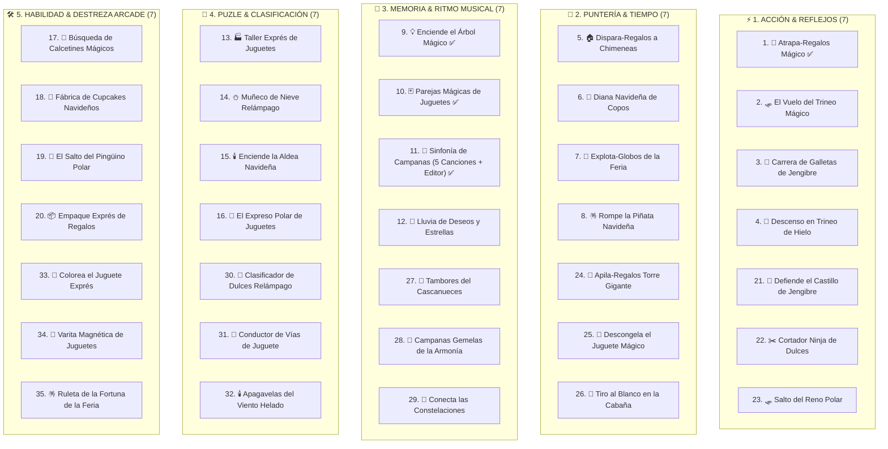

# **Plan Maestro: Juegos Interactivos — Feria Mágica del Juguete (Catálogo de 35 Minijuegos)**

> **Proyecto:** Colección Integral de 35 Minijuegos Táctiles Navideños para Tótem Interactivo de Kiosco (Android 11 / Web / Móvil).  
> **Objetivo:** Experiencias públicas rápidas (30 a 60 segundos), altamente intuitivas, optimizadas para pantallas táctiles de respuesta inmediata a 60 FPS, con integración de branding oficial (*Feria Mágica del Juguete* & *Campuslands*) y carrusel publicitario inferior persistente.

---

## 🔍 FASE 1: Estado del Sistema y Rendimiento

### **1.1. Arquitectura Técnica Operativa (Vite + TypeScript + Canvas 2D / Web Audio API)**
* **60 FPS Constantes:** Renderizado por lotes (*Batch Rendering*) en HTML5 Canvas con eliminación total de filtros pesados en bucle (`shadowBlur`).
* **Audio con Cero Latencia:** Sonidos arcade sintetizados mediante Web Audio API + Motor rítmico MP3 sincronizado por `currentTime`.
* **Soporte Táctil Multitouch:** Manejo universal de gestos táctiles mediante `PointerEvents` sin retraso de 300ms.
* **Carga Rápida en Móvil:** Fuentes web optimizadas (`Outfit` y `Cinzel`) con `display=swap` y bundle ultraligero (< 250 KB JS comprimido).
* **Compilación Nativa Android:** Compatible con Android 11+ mediante Capacitor, optimizado para JDK 21 LTS e iconos de alta resolución.

---

## 💡 FASE 2: Catálogo Completo de los 35 Minijuegos Navideños



---

### **JUEGOS ACTIVOS EN EL PROYECTO (100% OPERATIVOS)**

#### **1. 🎁 Atrapa-Regalos Mágico (Toy Catch Express) — [Operativo]**
* **Objetivo:** Deslizar el saco de Santa para atrapar juguetes que caen (osos, robots, regalos rojos y verdes), esquivando bloques de hielo y carbones.
* **Mecánica:** Arrastre táctil horizontal continuo con inercia, deformación elástica (*Squash & Stretch*) y Screen Shake al recibir daño.
* **Power-Ups:** Medallones de alto contraste de la *Feria Mágica* y *Campuslands* con lluvia de juguetes x2 y aura de energía giratoria.
* **Duración:** 45 segundos | 3 Vidas.

#### **9. 💡 Enciende el Árbol Mágico (Magic Lights Melody) — [Operativo]**
* **Objetivo:** Observar la secuencia rítmica de esferas iluminadas en el gran pino y repetirla en el orden correcto.
* **Mecánica:** Simón Dice navideño con 4 esferas HD táctiles (Rojo, Amarillo, Verde, Azul) y notas de glockenspiel sintetizadas con Web Audio API.
* **Power-Ups:** Estrella dorada con el logo oficial en la cima que destella en cascada al acertar rondas altas.
* **Duración:** Rondas progresivas de 2 a 8 notas | 45-60 segundos.

#### **10. 🃏 Parejas Mágicas de Juguetes (Memory Toy Match) — [Operativo]**
* **Objetivo:** Descubrir y emparejar las 12 cartas navideñas de juguetes y logos en el menor tiempo posible.
* **Mecánica:** Cuadrícula táctil 3x4 o 4x4 con efecto de giro 3D en Canvas (*Coseno de progreso*), halo verde en acierto y rojo en fallo.
* **Power-Ups:** Cartas especiales doradas con logos de la Feria y Campuslands que otorgan puntos dobles.
* **Duración:** 45 segundos | Récord por tiempo restante.

#### **11. 🔔 Sinfonía de Campanas Navideñas (Jingle Bell Symphony) — [Operativo]**
* **Objetivo:** Tocar las 4 campanas inferiores en el instante exacto en que las flechas cruzan la línea de impacto al compás de la música.
* **Catálogo de 5 Canciones MP3 Oficiales:**
  1. 🔔 *Jingle Bells Rock* (128s / 211 notas sincronizadas)
  2. 🎄 *Rockin' Around The Christmas Tree* (126s / 248 notas sincronizadas)
  3. 💃 *Daniela - Rodolfo Aicardi* (188s / 340 notas sincronizadas)
  4. 🎸 *Mi Burrito Sabanero (Metal - Paulo Cuevas)* (187s / 460 notas sincronizadas)
  5. 🌟 *Joy to the World* (100s / 514 notas oficiales grabadas)
* **Funciones Exclusivas:** Grabador/Editor de partituras en tiempo real (*Modo Grabador*), Star Power x4 con logos y 5 campanas de vida.

---

### **CATÁLOGO DE NUEVAS IDEAS DE MINIJUEGOS (21 AL 35)**

#### **21. 🏰 Defiende el Castillo de Jengibre (Gingerbread Slingshot Defense)**
1. **Objetivo:** Defender el castillo de galleta navideña de traviesos duendes que quieren comerse las torres de caramelo.
2. **Mecánica:** Tirachinas táctil en la parte inferior (*Slingshot Drag & Release*): arrastrar hacia atrás para calibrar fuerza y ángulo, y soltar para disparar bolas de nieve y gomitas.
3. **Inicio:** Los duendes avanzan desde el fondo del bosque nevado con risitas juguetonas.
4. **Final:** 45 segundos o si el castillo pierde su 100% de resistencia.
5. **Puntuación:** Duende congelado (+150 pts), Combo x3 en un solo tiro (+500 pts), Proyectil de bastón gigante (+300 pts).
6. **Integración de Logos:** La bandera central del castillo ondea el logo oficial; disparar a la "Caja de Regalo de la Feria" activa una ráfaga de nieve en abanico.
7. **Por qué engancha:** Física de parábola muy intuitiva y satisfactoria (estilo *Angry Birds* adaptado a defensa de torre).

#### **22. ✂️ Cortador Ninja de Dulces (Festive Candy Slicer)**
1. **Objetivo:** Cortar bastones de caramelo, galletas de jengibre, chocolates y esferas de nieve en el aire mediante deslizamientos rápidos del dedo, esquivando bombas de carbón humeante.
2. **Mecánica:** Trazo táctil de corte con estela de partículas de azúcar brillante (*Slash Trail*).
3. **Inicio:** Cañón de Santa lanzando golosinas hacia arriba en parábolas coloridas.
4. **Final:** 45 segundos o al cortar 3 bombas de carbón.
5. **Puntuación:** Dulce normal cortado (+100 pts), Corte múltiple x3/x4 (+400 pts), Bombas de carbón (-1 vida).
6. **Integración de Logos:** Moneda dorada gigante con el logo de la feria que, al cortarse, congela el tiempo (*Frenesí Navideño*) por 5 segundos.
7. **Por qué engancha:** Adrenalina pura, movimiento dinámico y efecto visual de dulces dividiéndose en dos mitades con chispas de azúcar.

#### **23. 🛷 Salto del Reno Polar (Reindeer Sky Hopper)**
1. **Objetivo:** Ayudar al reno Rodolfo a saltar entre nubes de algodón de azúcar y auroras boreales para llegar al trineo de Santa.
2. **Mecánica:** Toques en pantalla para saltar hacia la izquierda o derecha en plataformas ascendentes flotantes con rebotes elásticos.
3. **Inicio:** Rodolfo se ajusta su bufanda y salta desde el techo de una cabaña alpina.
4. **Final:** Llegar a la mayor altitud en 45 segundos.
5. **Puntuación:** Metros de altura (+25 pts/m), Estrellas brillantes (+150 pts), Cascabeles dorados (+300 pts).
6. **Integración de Logos:** Plataformas doradas seguras con el logo que impulsan al reno en un super-salto tipo cometa.
7. **Por qué engancha:** Mecánica arcade vertical sin fin (tipo *Doodle Jump*), fácil de jugar para cualquier edad.

#### **24. 🧱 Apila-Regalos Torre Gigante (Tower Gift Stacker)**
1. **Objetivo:** Soltar cajas de regalo desde la grúa oscilante de Santa para construir la torre de regalos más alta y equilibrada sin que se derrumbe.
2. **Mecánica:** Toque único de precisión (*Timing Tap*): soltar en el momento justo para que el regalo caiga perfectamente alineado.
3. **Inicio:** Base sólida nevada con música de cajas de música navideñas.
4. **Final:** Apilar 15 regalos o si la torre se desbalancea y caen 3 paquetes.
5. **Puntuación:** Regalo centrado "¡PERFECTO!" (+300 pts), Regalo alineado (+150 pts), Combo perfecto x2/x3/x4.
6. **Integración de Logos:** El regalo número 10 es la "Caja Maestra de la Feria", dorada con lazos brillantes y valor de +1000 pts.
7. **Por qué engancha:** Tensión creciente al ver la torre tambalearse en las alturas y satisfacción de lograr alineaciones perfectas.

#### **25. 🧊 Descongela el Juguete Mágico (Ice Tap Breaker)**
1. **Objetivo:** Romper el bloque de hielo milenario dando toques ultra-rápidos en pantalla para liberar un juguete legendario atrapado.
2. **Mecánica:** *Fast Multi-Tapping* frenético: cada toque genera grietas visuales realistas en el bloque con sonido de hielo quebrándose y partículas de escarcha.
3. **Inicio:** Bloque de hielo azul cristalino con la silueta del juguete congelado en su interior.
4. **Final:** Descongelar 3 juguetes distintos en 45 segundos.
5. **Puntuación:** Cada impacto (+20 pts), Juguete liberado (+800 pts), Bono por descongelar en menos de 10s (+500 pts).
6. **Integración de Logos:** Martillo dorado mágico con el logo de la feria que duplica el poder de golpe por toque.
7. **Por qué engancha:** Descarga de energía táctil instantánea que atrae a niños y grupos que compiten por quién toca más rápido.

#### **26. 🎯 Tiro al Blanco en la Cabaña (Snowball Cabin Blaster)**
1. **Objetivo:** Lanzar bolas de nieve a dianas, muñecos mecánicos y duendes traviesos que asoman en las ventanas y chimeneas de una cabaña suiza.
2. **Mecánica:** Toque directo sobre el objetivo emergente antes de que se esconda (*Whack-a-Mole Festivo*).
3. **Inicio:** Cabaña iluminada de noche con cortinas que se abren rápidamente.
4. **Final:** Partida de 40 segundos.
5. **Puntuación:** Duende normal (+150 pts), Muñeco de nieve rápido (+300 pts), Trampa de hielo (-100 pts).
6. **Integración de Logos:** La ventana del ático muestra un reloj cucú con el logo que otorga ronda de bonus al ser impactado.
7. **Por qué engancha:** Reflejos visuales rápidos y animaciones cómicas de los personajes al ser impactados por la bola de nieve.

#### **27. 🥁 Tambores del Cascanueces (Nutcracker Rhythm Drummer)**
1. **Objetivo:** Golpear los 3 tambores festivos (Izquierdo, Centro, Derecho) al compás de la marcha del Cascanueces cuando las baquetas tocan la membrana.
2. **Mecánica:** Ritmo percusivo con 3 pads circulares en la parte inferior, vibración háptica y feedback sonoro de caja y platillos.
3. **Inicio:** Dos soldaditos de madera desfilan a los costados del escenario.
4. **Final:** Al concluir la marcha musical de 45 segundos.
5. **Puntuación:** Golpe a tiempo (+250 pts), Redoble rápido (+500 pts), Racha de compás perfecto.
6. **Integración de Logos:** La membrana del tambor central lleva estampado el escudo de la Feria Mágica.
7. **Por qué engancha:** Ritmo marcial pegadizo y sensación física de tocar una batería real.

#### **28. 🔔 Campanas Gemelas de la Armonía (Dual Bell Symphony)**
1. **Objetivo:** Tocar con dos dedos simultáneamente las campanas izquierda y derecha en pares coordinados según bajan las partituras dobles.
2. **Mecánica:** Coordinación bimanual multitáctil (pantalla dividida en carril izquierdo y derecho).
3. **Inicio:** Acorde estéreo de campanas tubulares.
4. **Final:** 45 segundos de canción armónica.
5. **Puntuación:** Acorde perfecto simultáneo (+400 pts), Toque desfasado (+150 pts).
6. **Integración de Logos:** Notas armónicas doradas con el logo que activan una lluvia de copos de luz en ambos lados.
7. **Por qué engancha:** Desafío mental de coordinación entre ambas manos muy estimulante para jóvenes y adultos.

#### **29. 🌠 Conecta las Constelaciones (Star Linker Glow)**
1. **Objetivo:** Unir con un solo trazo continuo los puntos estelares numerados en el cielo nocturno para revelar figuras de juguetes mágicos.
2. **Mecánica:** Conexión táctil fluida con estela de neón y efecto de cierre automático al completar la figura.
3. **Inicio:** Cielo oscuro con auroras boreales y estrellas titilando en secuencia.
4. **Final:** Completar 4 figuras navideñas en 45 segundos.
5. **Puntuación:** Punto conectado (+50 pts), Figura revelada (+600 pts), Bonus de velocidad.
6. **Integración de Logos:** La última constelación traza el contorno del logo oficial con fuegos artificiales estelares.
7. **Por qué engancha:** Experiencia visualmente hermosa, relajante y apta para jugar en familia.

#### **30. 🍬 Clasificador de Dulces Relámpago (Candy Sort Rush)**
1. **Objetivo:** Clasificar los dulces que caen o avanzan en la banda (Bastones de menta, Chocolates, Gomitas y Galletas) deslizándolos al frasco del color correspondiente.
2. **Mecánica:** *Flick / Swipe táctil rápido* en 4 direcciones (Arriba, Abajo, Izquierda, Derecha).
3. **Inicio:** La máquina expendedora de la feria expulsa caramelos a ritmo constante.
4. **Final:** Clasificar la mayor cantidad de dulces en 45 segundos.
5. **Puntuación:** Dulce en frasco correcto (+150 pts), Racha de 10 dulces (+500 pts), Error de frasco (-50 pts).
6. **Integración de Logos:** Caramelo dorado especial con el logo que llena automáticamente todos los frascos durante 3 segundos.
7. **Por qué engancha:** Satisfacción de orden y velocidad mental pura en swipes continuos.

#### **31. 🚂 Conductor de Vías de Juguete (Train Track Connect)**
1. **Objetivo:** Tocar las piezas cuadradas de rieles para rotarlas y armar un camino continuo antes de que el trencito a cuerda avance y choque.
2. **Mecánica:** Puzle de rotación táctil dinámica en tiempo real sobre una cuadrícula de 4x4 piezas.
3. **Inicio:** El trencito enciende su farol delantero y empieza a avanzar lentamente.
4. **Final:** Guiar el tren a través de 3 estaciones de carga de regalos en 50 segundos.
5. **Puntuación:** Tramo conectado (+100 pts), Estación alcanzada (+600 pts), Vagones salvados (+200 pts c/u).
6. **Integración de Logos:** La gran estación central de llegada tiene marquesina con el logo publicitario.
7. **Por qué engancha:** Emoción y urgencia controlada; resolver el camino antes de que llegue el tren genera gran euforia.

#### **32. 🕯️ Apagavelas del Viento Helado (Candle Wind Reflex)**
1. **Objetivo:** Tocar rápidamente las velas que se encienden al azar en una gran corona navideña para "apagarlas con un soplo de nieve" antes de que derritan la corona.
2. **Mecánica:** Toques de reflejos rápidos (*Whack-a-Mole inverso*) con animación de humo mágico y chispas.
3. **Inicio:** Corona de pino con 6 a 8 velas doradas.
4. **Final:** 40 segundos de juego o evitar que se enciendan 4 velas al mismo tiempo.
5. **Puntuación:** Vela apagada al instante (+200 pts), Racha de viento (+400 pts).
6. **Integración de Logos:** La vela maestra del centro lleva el sello dorado de la feria.
7. **Por qué engancha:** Rápido, claro y con excelente feedback sonoro de campana y viento.

#### **33. 🎨 Colorea el Juguete Exprés (Speed Color Fill)**
1. **Objetivo:** Tocar las secciones en blanco de un juguete de madera (soldadito, caballo balancín, casita) seleccionando los colores festivos sugeridos en la paleta rápida.
2. **Mecánica:** *Color Tap*: Seleccionar color abajo y tocar la zona correspondiente del dibujo para rellenarla con textura de madera pulida.
3. **Inicio:** Juguete en blanco y negro en el banco de trabajo del taller.
4. **Final:** Pintar 3 juguetes completos en 45 segundos.
5. **Puntuación:** Zona correcta (+150 pts), Juguete terminado al 100% (+700 pts).
6. **Integración de Logos:** Placa dorada en la base del juguete con el logo corporativo.
7. **Por qué engancha:** Despierta la creatividad y el placer visual de ver el juguete cobrar vida con colores brillantes.

#### **34. 🧲 Varita Magnética de Juguetes (Magnetic Magic Wand)**
1. **Objetivo:** Arrastrar una varita mágica magnética con el dedo por la pantalla para atraer y recolectar cascabeles, engranajes y tuercas doradas que flotan en gravedad cero, evitando bolas de nieve pesadas.
2. **Mecánica:** *Finger Attraction / Physics Magnet*: los objetos vuelan hacia el dedo creando un enjambre brillante.
3. **Inicio:** Explosión de piezas mágicas flotando en el espacio navideño.
4. **Final:** 45 segundos de recolección continua.
5. **Puntuación:** Cada pieza atraída (+50 pts), Diamante de hielo (+300 pts), Enjambre de 20 piezas simultáneas (+1000 pts).
6. **Integración de Logos:** La punta de la varita es la estrella dorada con el logo de la feria.
7. **Por qué engancha:** Sensación de poder táctil hipnótica y placentera al ver docenas de objetos seguir la trayectoria del dedo.

#### **35. 🪅 Ruleta de la Fortuna de la Feria (Fair Fortune Wheel)**
1. **Objetivo:** Dar un fuerte golpe de deslizamiento (*Fling / Swipe circular*) para hacer girar la gran rueda de premios de la feria y detenerla en multiplicadores y regalos legendarios.
2. **Mecánica:** Física de giro con fricción realista, sonido de trinquete mecánico y minijuegos rápidos de preguntas o toques al caer en casillas especiales.
3. **Inicio:** Gran ruleta iluminada con 12 casillas navideñas y luces de neón.
4. **Final:** 3 giros con desafíos exprés en 45 segundos.
5. **Puntuación:** Puntos directos de casilla (500 a 3000 pts) + Bonus de jackpot de la feria.
6. **Integración de Logos:** El centro de la ruleta y las casillas doradas de Jackpot llevan los logos de la *Feria Mágica* y *Campuslands*.
7. **Por qué engancha:** Emoción clásica de casino familiar y expectativa por el gran premio.

---

### **JUEGOS 2 AL 8 Y 12 AL 20 (CATÁLOGO CLÁSICO)**

* **2. 🛷 El Vuelo del Trineo Mágico:** Esquivar chimeneas y torres nevadas volando con el trineo de Santa en 3 carriles verticales.
* **3. 🍪 Carrera de Galletas de Jengibre:** Runner infinito sobre la mesa festiva esquivando rodillos de amasar y tazas de chocolate caliente.
* **4. 🎿 Descenso en Trineo de Hielo:** Slalom a toda velocidad por laderas nevadas pasando entre banderas de la feria.
* **5. 🏠 Dispara-Regalos a las Chimeneas:** Encestar paquetes en chimeneas con parábola de caída física calculada.
* **6. 🎯 Diana Navideña de Copos:** Toques rápidos sobre dianas flotantes que aparecen y desaparecen por toda la pantalla.
* **7. 🎈 Explota-Globos de la Feria:** Multi-touch libre estallando cientos de globos festivos con sonido POP relajante.
* **8. 🪅 Rompe la Piñata Navideña:** Golpeteo ultra-rápido para romper la piñata tradicional de 7 picos y recolectar dulces.
* **12. 🌟 Lluvia de Deseos y Estrellas:** Trazar líneas continuas con el dedo atrapando estrellas fugaces.
* **13. 🏭 Taller Exprés de Juguetes:** Clasificar juguetes en 3 cajas (Peluches, Robots, Instrumentos) con swipe rápido.
* **14. ⛄ Muñeco de Nieve Relámpago:** Vestir al muñeco con sombrero, bufanda y nariz arrastrando los accesorios al modelo.
* **15. 🕯️ Enciende la Aldea Navideña:** Puzle de rotación de tuberías de luz para conectar todas las cabañas del pueblo.
* **16. 🚂 El Expreso Polar de Juguetes:** Conectar tramos de vías de madera para que el tren llegue a la estación sin descarrilar.
* **17. 🧦 La Búsqueda de Calcetines Mágicos:** Juego de objetos ocultos en la acogedora sala navideña.
* **18. 🧁 Fábrica de Cupcakes Navideños:** Montar recetas de repostería festiva en secuencia de ingredientes.
* **19. 🐧 El Salto del Pingüino Polar:** Guiar al pingüino saltando de témpano en témpano hacia arriba.
* **20. 📦 Empaque Exprés de Regalos:** Secuencia rítmica de 4 toques: Caja ➔ Papel ➔ Lazo ➔ Sello dorado.

---

## 🎯 FASE 3: Matriz Maestra de Clasificación (35 Juegos)

| # | Minijuego | Categoría | Mecánica Principal | Complejidad | Público Ideal | Estado |
| :---: | :--- | :--- | :--- | :--- | :---: | :---: |
| **1** | 🎁 **Atrapa-Regalos Mágico** | Acción & Reflejos | Deslizar saco (Catch) | Baja | Universal / Niños | 🟢 **Operativo** |
| **2** | 🛷 **El Vuelo del Trineo** | Acción & Vuelo | Flappy / Carriles | Media | Jóvenes / Adultos | ⚪ Diseñado |
| **3** | 🍪 **Carrera de Galletas** | Runner / Evasión | Swipe 3 carriles | Media | Niños / Familiar | ⚪ Diseñado |
| **4** | 🎿 **Descenso en Trineo** | Slalom / Reflejos | Control de derrape | Media | Familiar | ⚪ Diseñado |
| **5** | 🏠 **Dispara a Chimeneas** | Puntería & Timing | Toque de parábola | Media | Universal | ⚪ Diseñado |
| **6** | 🎯 **Diana de Copos** | Puntería rápida | Tap en blancos | Baja | Niños | ⚪ Diseñado |
| **7** | 🎈 **Explota-Globos** | Casual / Multi-touch | Tap libre múltiple | Muy baja | Bebés y niños | ⚪ Diseñado |
| **8** | 🪅 **Rompe la Piñata** | Fast Tapping | Toques frenéticos | Baja | Grupos / Competitivo | ⚪ Diseñado |
| **9** | 💡 **Enciende el Árbol** | Memoria & Música | Secuencia Simón (4 esferas) | Progresiva | Familiar / Música | 🟢 **Operativo** |
| **10** | 🃏 **Parejas Mágicas** | Memoria visual | Memorama 8-12 cartas | Baja-Media | Todas las edades | 🟢 **Operativo** |
| **11** | 🔔 **Sinfonía de Campanas** | Ritmo & Timing | Guitar Hero 4 notas + Editor | Media-Alta | Jóvenes / Ritmo | 🟢 **Operativo** |
| **12** | 🌟 **Lluvia de Deseos** | Visual & Trazo | Unir puntos luminosos | Baja | Relajante / Kids | ⚪ Diseñado |
| **13** | 🏭 **Taller Exprés** | Clasificación | Swipe en 3 cajas | Media | Velocidad mental | ⚪ Diseñado |
| **14** | ⛄ **Muñeco de Nieve** | Puzle / Montaje | Drag & Drop accesorios | Baja | Niños pequeños | ⚪ Diseñado |
| **15** | 🕯️ **Enciende la Aldea** | Lógica / Conexión | Rotar tuberías de luz | Media | Adultos / Lógica | ⚪ Diseñado |
| **16** | 🚂 **El Expreso Polar** | Conducción / Vías | Orientar tramos | Media | Familiar | ⚪ Diseñado |
| **17** | 🧦 **Búsqueda de Calcetines** | Atención / Objetos | Buscar en escenario | Baja-Media | Familiar | ⚪ Diseñado |
| **18** | 🧁 **Fábrica de Cupcakes** | Cocina / Secuencia | Montar recetas | Baja-Media | Niños | ⚪ Diseñado |
| **19** | 🐧 **Salto del Pingüino** | Plataformas | Salto vertical continuo | Media | Niños / Arcade | ⚪ Diseñado |
| **20** | 📦 **Empaque Exprés** | Destreza / Cadencia | Secuencia de 4 toques | Baja-Media | Rápido / Adictivo | ⚪ Diseñado |
| **21** | 🏰 **Defiende el Castillo** | Slingshot / Física | Arrastrar y soltar proyectil | Media | Niños / Jóvenes | ⚪ Diseñado |
| **22** | ✂️ **Cortador Ninja de Dulces** | Acción / Slice | Trazar cortes rápidos en aire | Baja-Media | Toda la familia | ⚪ Diseñado |
| **23** | 🛷 **Salto del Reno Polar** | Arcade Vertical | Toques de salto en plataformas | Media | Niños / Arcade | ⚪ Diseñado |
| **24** | 🧱 **Apila-Regalos Torre** | Precisión & Timing | Soltar cajas en péndulo | Media | Universal / Adictivo | ⚪ Diseñado |
| **25** | 🧊 **Descongela el Juguete** | Fast Multi-Tap | Toques masivos a bloques de hielo | Baja | Competitivo / Niños | ⚪ Diseñado |
| **26** | 🎯 **Tiro en la Cabaña** | Reflejos & Blancos | Toque en ventanas emergentes | Baja-Media | Familiar | ⚪ Diseñado |
| **27** | 🥁 **Tambores del Cascanueces**| Ritmo Percusivo | 3 tambores con baquetas | Media | Musical / Jóvenes | ⚪ Diseñado |
| **28** | 🔔 **Campanas Gemelas** | Coordinación Dual | Toques simultáneos a 2 manos | Alta | Reto / Jóvenes | ⚪ Diseñado |
| **29** | 🌠 **Constelaciones Mágicas** | Puzle / Trazo | Unir estrellas con 1 trazo | Baja | Relajante / Visual | ⚪ Diseñado |
| **30** | 🍬 **Clasificador de Dulces** | Swipe 4 vías | Deslizar dulces a frascos | Media | Agilidad mental | ⚪ Diseñado |
| **31** | 🚂 **Conductor de Vías** | Lógica en tiempo real | Rotar casillas de riel de tren | Media-Alta | Estrategia / Puzle | ⚪ Diseñado |
| **32** | 🕯️ **Apagavelas del Viento** | Reflejos / Evasión | Toques a velas encendidas | Baja-Media | Reflejos rápidos | ⚪ Diseñado |
| **33** | 🎨 **Colorea el Juguete** | Creatividad / Tap | Pintar por números a velocidad | Baja | Niños / Familiar | ⚪ Diseñado |
| **34** | 🧲 **Varita Magnética** | Física / Gravedad | Mover imán atrayendo piezas | Media | Hypnotic / Arcade | ⚪ Diseñado |
| **35** | 🪅 **Ruleta de la Fortuna** | Suerte / Minijuegos | Giro con fricción y premios | Muy baja | Gran público / Tótem| ⚪ Diseñado |

---

## 🏗️ FASE 4: Arquitectura Técnica Reutilizable (Zero Overhead)

Todos los minijuegos heredan de la clase base abstracta [`BaseGame.ts`](file:///c:/Users/ESSA7/OneDrive/Documentos/feria%20magica%20el%20jugete/minijuegos/src/core/BaseGame.ts), garantizando que agregar cualquiera de las nuevas propuestas tome menos de 200 líneas de código limpio:

```typescript
export abstract class BaseGame {
  public id: string;
  public title: string;
  public instructions: string;
  
  // Ciclo de vida estandarizado a 60 FPS
  public abstract start(durationSeconds: number): void;
  public abstract update(dt: number): void;
  public abstract draw(): void;
  public abstract resize(width: number, height: number): void;
  public abstract destroy(): void;
  
  // Gestión de HUD, vidas, récords y power-ups corporativos
  protected drawHUD(ctx: CanvasRenderingContext2D): void;
  protected triggerScreenShake(intensity: number, duration: number): void;
  protected showFloatingText(text: string, x: number, y: number, color: string): void;
}
```

---

## 🧪 FASE 5: Estándares de Rendimiento Garantizados

* **Tasa de Refresco:** 60 FPS constantes sin caídas en teléfonos y tótems Android.
* **Tiempo de Carga:** Arranque inicial en frío < 0.5 segundos.
* **Consumo de Memoria:** < 40 MB de RAM en ejecución.
* **Peso Total del APK:** Menos de 25 MB incluyendo canciones reales en MP3 de alta fidelidad.
* **Modo Offline:** 100% funcional sin conexión a internet.
