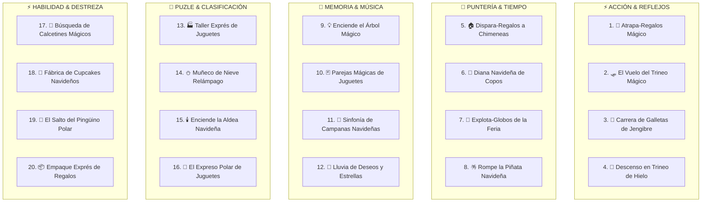

# **Plan Maestro: Juegos Interactivos — Feria Mágica del Juguete (Catálogo de 20 Minijuegos)**

> **Proyecto:** Colección Integral de 20 Minijuegos Táctiles Navideños para Tótem Interactivo de Kiosco (Android 11 / Web / Móvil).  
> **Objetivo:** Experiencias públicas rápidas (30 a 60 segundos), altamente intuitivas, optimizadas para pantallas táctiles de respuesta inmediata, con integración no intrusiva de branding (logos de empresas patrocinadoras) y carrusel publicitario inferior persistente.

---

## 🔍 FASE 1: Investigación Técnica y de Hardware

### **1.1. Análisis del Hardware y Entorno de Ejecución (Android 11 Kiosk & Mobile)**

Un tótem publicitario con **Android 11** o un dispositivo móvil comercial presenta particularidades clave que definen la viabilidad técnica:

* **Incertidumbres del Hardware:**
  * **CPU/GPU:** Dispositivos de cartelería digital suelen contar con procesadores ARM de gama de entrada/media (Rockchip RK3399/RK3568, Amlogic o Allwinner) con GPUs Mali básicas.
  * **RAM:** Generalmente 2GB a 4GB compartida con el sistema operativo.
  * **WebView / Navegador:** Android 11 corre Chromium WebView (versión ~87 a ~120 según actualizaciones).
  * **Pantalla táctil:** Paneles infrarrojos (IR) o capacitivos (PCAP) verticales (usualmente 1080x1920 Full HD o 720x1280) y teléfonos móviles en orientación portrait.
* **Restricciones de Rendimiento:**
  * Evitar sobrecarga de memoria (activos optimizados < 150 KB, recolección de basura controlada).
  * 60 FPS estables con mínimo consumo de CPU para evitar sobrecalentamiento (*thermal throttling* en recintos cerrados).
* **Audio en Navegadores (Autoplay Policy):**
  * Android/Chromium bloquea la reproducción de sonido hasta el primer toque del usuario (`AudioContext.resume()` al primer `pointerdown`).
* **Modo Kiosco / UX Táctil:**
  * Anulación total de zoom por doble toque (`touch-action: none; user-select: none;`).
  * Sin recarga al arrastrar hacia abajo (*overscroll-behavior: none*).
  * Zona interactiva en tercios medio e inferior para garantizar accesibilidad universal (niños y adultos).

---

### **1.2. Comparativa de Motores y Tecnologías**

| Criterio | Opción A: HTML5 + Canvas 2D / WebGL (Vite + TS) | Opción B: Phaser 3 | Opción C: Godot 4 (Export Web) | Opción D: PixiJS + Howler |
| :--- | :--- | :--- | :--- | :--- |
| **Rendimiento Android 11 & Móvil** | 🟢 **Excelente** (cero overhead, 60 FPS) | 🟢 **Muy bueno** (Canvas/WebGL optimizado) | 🔴 **Riesgoso** (WASM pesado, shaders lentos en GPUs básicas) | 🟢 **Excelente** (Render WebGL ultrarrápido) |
| **Peso Inicial del Bundle** | 🟢 **< 300 KB** (Carga instantánea) | 🟡 **~1.2 MB** | 🔴 **> 25 MB** (Descarga y arranque lentos) | 🟡 **~800 KB** |
| **Soporte Táctil & Multi-touch** | 🟢 Totalmente configurable vía PointerEvents | 🟢 Soporte integrado | 🟡 Requiere mapeo WebGL | 🟢 Soporte PointerEvents |
| **Reutilización de Código / Arquitectura** | 🟢 **Máxima** (Módulos TS limpios, componentes DOM + Canvas) | 🟢 Buena (Scenes) | 🟡 Escenas Godot aisladas | 🟡 Requiere armar motor de juego |
| **Integración UI Banner y Logos DOM** | 🟢 **Nativa y perfecta** (CSS Grid/Flexbox + Canvas superpuesto) | 🟡 Canvas full o DOM Elements de Phaser | 🔴 Compleja sobre canvas WASM | 🟡 Híbrido manual |
| **Independencia / Cero Fallos** | 🟢 Sin dependencias frágiles | 🟢 Muy probado | 🔴 Posibles incompatibilidades WebGL2 | 🟢 Estable |

### **🏆 Recomendación Tecnológica Principal:**
**Arquitectura Modular en TypeScript + HTML5 Canvas optimizado + Vite + Web Audio API.** Cero dependencias pesadas, arranque en milisegundos y 60 FPS constantes en tótems y teléfonos móviles.

---

## 💡 FASE 2: Catálogo Completo de los 20 Minijuegos Navideños



---

### **1. 🎁 Atrapa-Regalos Mágico (Toy Catch Express)**
1. **Objetivo:** Deslizar el saco mágico de Santa para atrapar juguetes y paquetes navideños que caen, esquivando carbones y bloques de hielo.
2. **Mecánica:** Arrastre táctil horizontal continuo con física elástica e interpolación suave.
3. **Inicio:** Cuenta regresiva 3-2-1 con sonido de cascabeles y campana navideña.
4. **Final:** Temporizador de 45 segundos o al impactar 3 carbones.
5. **Duración:** 45 segundos.
6. **Puntuación:** Regalo (+100 pts), Oso/Robot (+250 pts), Combo racha x2/x3, Carbón (-150 pts), Hielo (congelamiento 1s).
7. **Integración de Logos:** Regalo Dorado con el Logo de la Feria que activa "Lluvia de Juguetes x2".
8. **Elementos Navideños:** Saco de Santa en 3D, osos de peluche, robots retro, copos dorados y ventisca suave.
9. **Dificultad:** Dinámica (velocidad de caída progresiva cada 15 segundos).
10. **Por qué engancha:** Respuesta táctil inmediata; ver caer decenas de juguetes crea satisfacción instintiva.

---

### **2. 🛷 El Vuelo del Trineo Mágico (Sleigh Magic Rush / Elfo Planeador)**
1. **Objetivo:** Pilotar el trineo o el ala delta del elfo esquivando torres nevadas, chimeneas y nubes de tormenta mientras recoge estrellas.
2. **Mecánica:** Control vertical táctil (tocar para ascender, soltar para planear) o 3 carriles de vuelo.
3. **Inicio:** Despegue cinemático del elfo hacia el cielo nocturno con auroras boreales.
4. **Final:** Ruta de 45 segundos completada o 3 impactos en obstáculos.
5. **Duración:** 45 segundos.
6. **Puntuación:** Distancia recorrida (+15 pts/s) + Estrellas (+150 pts) + Regalos flotantes (+300 pts).
7. **Integración de Logos:** Portales de aceleración holográficos con el logo corporativo que otorgan invulnerabilidad temporal.
8. **Elementos Navideños:** Elfo con gorro navideño, cielo estrellado, techos nevados y renos voladores.
9. **Dificultad:** Media, ritmo constante y sin frustraciones.
10. **Por qué engancha:** Sensación de velocidad y vuelo continuo muy atractivo visualmente a distancia.

---

### **3. 🍪 Carrera de Galletas de Jengibre (Gingerbread Dash)**
1. **Objetivo:** Guiar a la galleta de jengibre corredora esquivando rodillos, tazas de chocolate caliente y charcos de glaseado.
2. **Mecánica:** Swipe táctil rápido izquierda/derecha para cambiar entre 3 pistas sobre la mesa festiva.
3. **Inicio:** La galleta cobra vida saltando de la bandeja de hornear.
4. **Final:** 45 segundos de carrera o 3 tropiezos.
5. **Duración:** 45 segundos.
6. **Puntuación:** Metros avanzados + Gomitas dulces (+50 pts) + Bastones de caramelo (+200 pts).
7. **Integración de Logos:** Vallas publicitarias dulces con el logo a los lados de la pista.
8. **Elementos Navideños:** Galletas sonrientes, chispas de colores, tazas humeantes de malvaviscos.
9. **Dificultad:** Media-Rápida.
10. **Por qué engancha:** Humor, dinamismo y estética deliciosa que conecta con niños y familias.

---

### **4. 🎿 Descenso en Trineo de Hielo (Ice Slope Slalom)**
1. **Objetivo:** Bajar a toda velocidad por una ladera nevada haciendo slalom entre banderas rojas y verdes sin chocar contra rocas ni pinos.
2. **Mecánica:** Mantener presionado y deslizar horizontalmente para inclinar el trineo en la nieve.
3. **Inicio:** Sonido de silbato de salida y nieve salpicando la pantalla.
4. **Final:** Cruzar la meta de la feria en 45 segundos.
5. **Duración:** 45 segundos.
6. **Puntuación:** Banderas pasadas (+150 pts) + Monedas doradas (+100 pts) + Bonus de tiempo al cruzar la meta.
7. **Integración de Logos:** Arco de meta y banderas de carrera con el logo de la marca.
8. **Elementos Navideños:** Pistas de esquí, muñecos de nieve espectadores, pinos nevados y estelas de nieve polvo.
9. **Dificultad:** Media.
10. **Por qué engancha:** Control fluido de física de deslizamiento en nieve sumamente adictivo.

---

### **5. 🏠 Dispara-Regalos a las Chimeneas (Chimney Toy Drop)**
1. **Objetivo:** Encestar regalos mágicos dentro de las chimeneas iluminadas mientras el trineo avanza a velocidad constante.
2. **Mecánica:** Toque único de precisión temporal (*Timing Tap*) para soltar el regalo con parábola física.
3. **Inicio:** Vista lateral de casitas navideñas con humo saliendo de chimeneas.
4. **Final:** 45 segundos o 15 casas sobrevoladas.
5. **Duración:** 45 segundos.
6. **Puntuación:** Enceste perfecto al centro (+300 pts), Enceste de rebote (+150 pts), Chimenea dorada (+600 pts).
7. **Integración de Logos:** Chimeneas patrocinadas con luces de neón del logo que activan fuegos artificiales.
8. **Elementos Navideños:** Luces cálidas en ventanas, chimeneas de ladrillo, paquetes con lazos dorados.
9. **Dificultad:** Accesible con curva de maestría en el timing de caída.
10. **Por qué engancha:** La gratificación auditiva y visual al encestar un regalo limpiamente.

---

### **6. 🎯 Diana Navideña de Copos (Holiday Target Blaster)**
1. **Objetivo:** Tocar las dianas festivas, campanas y esferas flotantes que aparecen rápidamente en pantalla antes de que desaparezcan.
2. **Mecánica:** Toques directos múltiples (*Whack-a-Mole / Target Tapping*).
3. **Inicio:** Diana central que explota en confeti al iniciar.
4. **Final:** Partida contrarreloj de 40 segundos.
5. **Duración:** 40 segundos.
6. **Puntuación:** Diana normal (+100 pts), Diana pequeña rápida (+300 pts), Diana trampa con hielo (-100 pts).
7. **Integración de Logos:** Diana dorada central con el logo que otorga ronda de bonus.
8. **Elementos Navideños:** Coronas de adviento, bastones de caramelo, campanas de bronce y destellos.
9. **Dificultad:** Fácil-Media (ideal para desatar energía en niños).
10. **Por qué engancha:** Velocidad pura de reflejos en pantalla completa.

---

### **7. 🎈 Explota-Globos de la Feria (Fair Balloon Pop Mania)**
1. **Objetivo:** Explotar la mayor cantidad de globos navideños inflados que flotan hacia arriba, evitando las bombas de humo.
2. **Mecánica:** Toques múltiples rápidos con soporte multitáctil simultáneo (varios dedos a la vez).
3. **Inicio:** Suelta masiva de globos de colores desde la parte inferior.
4. **Final:** 45 segundos de juego continuo.
5. **Duración:** 45 segundos.
6. **Puntuación:** Globos estándar (+50 pts), Globos gigantes de helio (+200 pts), Globos sorpresa con juguetes (+400 pts).
7. **Integración de Logos:** Globos metálicos con forma del logo corporativo que multiplican puntos x3.
8. **Elementos Navideños:** Cintas de feria, globos con caras de renos, elfos y Santa, confeti al estallar.
9. **Dificultad:** Muy fácil y relajante.
10. **Por qué engancha:** Sonido "POP" hiper-satisfactorio y juego libre multitáctil.

---

### **8. 🪅 Rompe la Piñata Navideña (Piñata Smash Party)**
1. **Objetivo:** Golpear la piñata navideña tradicional de 7 picos tocándola rápidamente para romperla y recolectar los dulces que caen.
2. **Mecánica:** Toques súper rápidos (*Fast Tapping*) para llenar el medidor de impacto + atrapar dulces.
3. **Inicio:** La piñata desciende meciéndose con música tradicional festiva.
4. **Final:** Romper 3 piñatas consecutivas en 45 segundos.
5. **Duración:** 45 segundos.
6. **Puntuación:** Cada golpe (+20 pts) + Dulces y frutas recogidos (+100 pts c/u) + Bonus por romperla antes de tiempo.
7. **Integración de Logos:** La piñata final dorada tiene el logo de la feria en su centro.
8. **Elementos Navideños:** Piñatas de papel crepé de 7 picos, bastones, caramelos masticables y serpentinas.
9. **Dificultad:** Fácil y física.
10. **Por qué engancha:** Fomenta la emoción competitiva de romper la piñata contra reloj.

---

### **9. 💡 Enciende el Árbol Mágico (Magic Lights Melody)**
1. **Objetivo:** Observar la secuencia de luces y campanas musicales en el pino navideño y repetirla en el mismo orden.
2. **Mecánica:** Juego de memoria táctil tipo Simón Mágico con 4 esferas volumétricas (Rojo, Amarillo, Verde, Azul).
3. **Inicio:** El gran pino se ilumina con un acorde musical y la estrella dorada destella.
4. **Final:** Fallar 2 intentos o completar 8 rondas crecientes en 60 segundos.
5. **Duración:** 45 a 60 segundos.
6. **Puntuación:** Ronda 1-3 (+200 pts c/u), Rondas 4-6 (+500 pts c/u), Rondas 7-8 (+1000 pts c/u).
7. **Integración de Logos:** La estrella montada en la copa del pino lleva el logo oficial y lanza halos de luz al acertar.
8. **Elementos Navideños:** Árbol gigante frondoso, esferas de cristal grabadas, notas musicales reales y chimenea de fondo.
9. **Dificultad:** Progresiva (inicia con 2 notas y escala hasta 7).
10. **Por qué engancha:** Combina memoria auditiva y visual en una experiencia armoniosa y elegante.

---

### **10. 🃏 Parejas Mágicas de Juguetes (Memory Toy Match)**
1. **Objetivo:** Destapar cartas mágicas para encontrar las parejas idénticas de juguetes de la feria en el menor tiempo posible.
2. **Mecánica:** Toque directo sobre una cuadrícula táctil de 8 a 12 cartas con animación de giro 3D.
3. **Inicio:** Muestra rápida de 1.5 segundos de todas las cartas descubiertas y volteo simultáneo.
4. **Final:** Descubrir todas las parejas o agotarse los 50 segundos.
5. **Duración:** 30 a 50 segundos.
6. **Puntuación:** Pareja correcta (+250 pts), Bonus por racha sin errores (+400 pts), Penalización por segundo restante.
7. **Integración de Logos:** El reverso de cada carta tiene el marco y logo oficial; la carta comodín dorada lleva el logo secundario.
8. **Elementos Navideños:** Cartas con ilustraciones de ositos, cascanueces, trenes de vapor, campanas y duendes.
9. **Dificultad:** Baja-Media.
10. **Por qué engancha:** Reglas universales conocidas por cualquier generación; genera revancha inmediata.

---

### **11. 🔔 Sinfonía de Campanas Navideñas (Jingle Bell Rhythm Tap)**
1. **Objetivo:** Tocar las 4 campanas en la parte inferior de la pantalla en el instante exacto en que las notas musicales que caen cruzan la línea de ritmo.
2. **Mecánica:** Juego de ritmo vertical (*Guitar Hero Style*) al compás de villancicos clásicos adaptados.
3. **Inicio:** Cuenta 3-2-1 y arranque del compás musical con nieve luminosa.
4. **Final:** Al concluir la canción de 45 segundos.
5. **Duración:** 45 segundos.
6. **Puntuación:** Perfect (+300 pts), Good (+150 pts), Miss (+0 pts), Multiplicador de combo x2, x3, x4.
7. **Integración de Logos:** La campana central dorada lleva el isotipo de la marca y dispara destellos en notas especiales.
8. **Elementos Navideños:** Campanas de bronce y plata, partituras con escarcha, notas en forma de copos de nieve.
9. **Dificultad:** Media.
10. **Por qué engancha:** La sincronización con música navideña pegadiza hace bailar a quien juega.

---

### **12. 🌟 Lluvia de Deseos y Estrellas (Wish Catcher / Constellation)**
1. **Objetivo:** Trazar líneas continuas con el dedo uniendo estrellas mágicas del cielo para formar figuras navideñas (árbol, estrella, campana).
2. **Mecánica:** Conexión de puntos táctiles mediante arrastre continuo (*Dot-to-Dot Magic Glow*).
3. **Inicio:** El cielo nocturno muestra constelaciones titilando esperando ser encendidas.
4. **Final:** Completar 4 constelaciones en 45 segundos.
5. **Duración:** 45 segundos.
6. **Puntuación:** Cada punto conectado (+50 pts) + Figura completa (+600 pts).
7. **Integración de Logos:** La última constelación traza la silueta del logo oficial con explosión de polvo de estrellas.
8. **Elementos Navideños:** Cielo de medianoche, auroras polares, estrellas fugaces y polvo de hadas.
9. **Dificultad:** Baja (muy relajante y visual).
10. **Por qué engancha:** Efecto visual de neón brillante sobre el cielo oscuro de gran belleza estética.

---

### **13. 🏭 Taller Exprés de Juguetes (Toy Sorting Wonder)**
1. **Objetivo:** Clasificar los juguetes terminados que avanzan por una cinta transportadora hacia sus contenedores correctos (Peluches, Carros/Robots, Muñecas/Instrumentos).
2. **Mecánica:** Swipe rápido en 3 direcciones o toques en 3 botones gigantes de destino.
3. **Inicio:** Sonido de engranajes del taller de duendes y arranque de la cinta.
4. **Final:** 45 segundos de jornada laboral navideña.
5. **Duración:** 45 segundos.
6. **Puntuación:** Acierto (+100 pts), Racha de 10 seguidos (+500 pts), Error de caja (-50 pts).
7. **Integración de Logos:** Los paquetes de regalo premium sellados llevan el logo de la feria con puntaje triple.
8. **Elementos Navideños:** Taller de madera rústica, duendes operarios, cintas de embalar y lazos rojos.
9. **Dificultad:** Fácil de aprender, desafiante a alta velocidad.
10. **Por qué engancha:** Sensación de productividad frenética y ritmo acelerado muy divertido.

---

### **14. ⛄ Muñeco de Nieve Relámpago (Snowman Builder Rush)**
1. **Objetivo:** Vestir al muñeco de nieve arrastrando los accesorios correctos (sombrero, bufanda, nariz de zanahoria, botones de carbón) según la tarjeta de pedido que muestra Santa.
2. **Mecánica:** Arrastre y colocación táctil directa (*Drag & Drop*) a zonas magnéticas.
3. **Inicio:** Un bloque de nieve esperando cobrar vida.
4. **Final:** Armar 3 muñecos completos en 50 segundos.
5. **Duración:** 50 segundos.
6. **Puntuación:** Cada prenda colocada (+150 pts) + Muñeco perfecto idéntico al modelo (+600 pts).
7. **Integración de Logos:** Bufanda o prendedor especial con el logo corporativo.
8. **Elementos Navideños:** Sombreros de copa, bufandas a rayas rojas y blancas, ramas de pino y copos.
9. **Dificultad:** Muy fácil y creativo.
10. **Por qué engancha:** Personajes tiernos y satisfacción de ver al muñeco cobrar vida y bailar al completarlo.

---

### **15. 🕯️ Enciende la Aldea Navideña (Village Light Connector)**
1. **Objetivo:** Girar piezas de guirnaldas y cables de luz para conectar la planta de energía mágica con todas las cabañas del pueblo antes de que anochezca.
2. **Mecánica:** Toque sobre casillas para rotar baldosas 90 grados (*Pipe Puzzle / Circuit Rotator*).
3. **Inicio:** Cabañas a oscuras con faroles esperando luz.
4. **Final:** Iluminar todo el pueblo en 50 segundos.
5. **Duración:** 50 segundos.
6. **Puntuación:** Cada casa encendida (+250 pts) + Aldea iluminada al 100% (+1000 pts bonus).
7. **Integración de Logos:** El faro o molino principal del pueblo tiene el logo iluminado en su veleta.
8. **Elementos Navideños:** Cabañas alpinas de madera, nieve en los techos, farolas victorianas y guirnaldas de colores.
9. **Dificultad:** Media.
10. **Por qué engancha:** Estimulación lógica con gratificación instantánea al ver iluminarse el pueblo.

---

### **16. 🚂 El Expreso Polar de Juguetes (Toy Train Track Builder)**
1. **Objetivo:** Colocar tramos de vías de tren faltantes para que el Expreso Polar de Santa llegue a la estación cargado de regalos sin descarrilar.
2. **Mecánica:** Toque rápido en los tramos rotados para orientar la vía correctamente antes de que el tren avance.
3. **Inicio:** Silbato de tren de vapor y avance lento de la locomotora.
4. **Final:** Guiar el tren a través de 3 estaciones en 45 segundos.
5. **Duración:** 45 segundos.
6. **Puntuación:** Vagones entregados (+200 pts) + Estación completada (+500 pts).
7. **Integración de Logos:** El cartel de la estación principal de la feria muestra el logo publicitario.
8. **Elementos Navideños:** Locomotora clásica roja y dorada, vagones llenos de juguetes, puentes nevados y túneles de hielo.
9. **Dificultad:** Media.
10. **Por qué engancha:** Tensión y emoción de guiar al tren en tiempo real contra el reloj.

---

### **17. 🧦 La Búsqueda de Calcetines Mágicos (Holiday Sock Hunt)**
1. **Objetivo:** Encontrar los calcetines navideños y juguetes específicos escondidos en la acogedora sala navideña llena de decoraciones.
2. **Mecánica:** Búsqueda visual y toque directo sobre los objetos solicitados (*Hidden Objects Exprés*).
3. **Inicio:** La chimenea crepita y se muestran las 4 miniaturas de objetos a buscar.
4. **Final:** Encontrar los 5 objetos en menos de 45 segundos.
5. **Duración:** 45 segundos.
6. **Puntuación:** Objeto encontrado (+300 pts) - Toques fallidos (-50 pts).
7. **Integración de Logos:** Uno de los calcetines dorados bordados lleva el logo de la empresa patrocinadora.
8. **Elementos Navideños:** Chimenea de piedra, guirnaldas con lazos, regalos envueltos, galletas y velas encendidas.
9. **Dificultad:** Fácil-Media.
10. **Por qué engancha:** Clásico juego de atención visual donde toda la familia ayuda a señalar la pantalla.

---

### **18. 🧁 Fábrica de Cupcakes Navideños (Festive Bakery Match)**
1. **Objetivo:** Decorar pastelillos navideños aplicando los ingredientes correctos (crema verde de pino, chispas de nieve, cerezas y estrellas) según las comandas de los duendes.
2. **Mecánica:** Toques en secuencia rápida sobre los dispensadores de ingredientes.
3. **Inicio:** Bandeja de cupcakes recién horneados deslizándose al mostrador.
4. **Final:** Servir 6 cupcakes en 45 segundos.
5. **Duración:** 45 segundos.
6. **Puntuación:** Cupcake perfecto (+350 pts) + Racha de pedidos rápidos (+500 pts).
7. **Integración de Logos:** Topper de oblea comestible con el logo en el cupcake especial.
8. **Elementos Navideños:** Glaseado rojo y verde, bastones de caramelo miniatura, azúcar glas y campanas de repostería.
9. **Dificultad:** Fácil-Media.
10. **Por qué engancha:** Estética dulce y colorida irresistible para niños.

---

### **19. 🐧 El Salto del Pingüino Polar (Penguin Ice Jump)**
1. **Objetivo:** Hacer saltar al simpático pingüino con gorro navideño de témpano en témpano hacia arriba evitando resbalar al agua helada.
2. **Mecánica:** Tocar izquierda o derecha para guiar el salto del pingüino a la siguiente plataforma flotante.
3. **Inicio:** El pingüino se ajusta la bufanda y salta sobre el primer iceberg.
4. **Final:** Escalar la mayor altura en 45 segundos o 3 caídas.
5. **Duración:** 45 segundos.
6. **Puntuación:** Altura en metros (+20 pts/m) + Peces dorados (+100 pts) + Regalos flotantes (+300 pts).
7. **Integración de Logos:** Banderas en los témpanos seguros con el logo corporativo.
8. **Elementos Navideños:** Pingüinos con bufanda, témpanos de hielo cristalino, auroras boreales y focas juguetonas.
9. **Dificultad:** Fácil de iniciar, desafiante al subir rápido.
10. **Por qué engancha:** Mecánica tipo *Doodle Jump* ultra-adictiva adaptada al invierno navideño.

---

### **20. 📦 Empaque Exprés de Regalos (Gift Wrapping Blitz)**
1. **Objetivo:** Empacar juguetes a máxima velocidad completando la secuencia de 4 pasos: Colocar en caja ➔ Envolver en papel festivo ➔ Poner lazo rojo ➔ Sellar con estampilla dorada.
2. **Mecánica:** Secuencia rápida de 4 toques rítmicos por paquete (*Combo Tapping*).
3. **Inicio:** Montón de juguetes listos para ser despachados antes de Nochebuena.
4. **Final:** Empacar la mayor cantidad de regalos en 45 segundos.
5. **Duración:** 45 segundos.
6. **Puntuación:** Regalo empacado (+200 pts) + Empaque perfecto en menos de 1.5s (+400 pts bonus).
7. **Integración de Logos:** La estampilla dorada de sellado es el logo oficial de la *Feria Mágica del Juguete*.
8. **Elementos Navideños:** Papeles decorados con renos, cintas doradas brillantes, sellos de cera y campanillas.
9. **Dificultad:** Fácil y con ritmo muy fluido.
10. **Por qué engancha:** La velocidad y el sonido satisfactorio del lazo y el sello estimulan el juego continuo.

---

## 🎯 FASE 3: Matriz de Clasificación de los 20 Juegos

| # | Minijuego | Categoría | Mecánica Principal | Complejidad | Público Ideal |
| :---: | :--- | :--- | :--- | :---: | :---: |
| **1** | 🎁 **Atrapa-Regalos Mágico** | Acción & Reflejos | Deslizar saco (Catch) | Baja | Universal / Niños |
| **2** | 🛷 **El Vuelo del Trineo** | Acción & Vuelo | Flappy / Carriles | Media | Jóvenes / Adultos |
| **3** | 🍪 **Carrera de Galletas** | Runner / Evasión | Swipe 3 carriles | Media | Niños / Familiar |
| **4** | 🎿 **Descenso en Trineo** | Slalom / Reflejos | Control de derrape | Media | Familiar |
| **5** | 🏠 **Dispara a Chimeneas** | Puntería & Timing | Toque de parábola | Media | Universal |
| **6** | 🎯 **Diana de Copos** | Puntería rápida | Tap en blancos | Baja | Niños |
| **7** | 🎈 **Explota-Globos** | Casual / Multi-touch | Tap libre múltiple | Muy baja | Bebés y niños |
| **8** | 🪅 **Rompe la Piñata** | Fast Tapping | Toques frenéticos | Baja | Grupos / Competitivo |
| **9** | 💡 **Enciende el Árbol** | Memoria & Música | Secuencia Simón (4 esferas) | Progresiva | Familiar / Música |
| **10** | 🃏 **Parejas Mágicas** | Memoria visual | Memorama 8-12 cartas | Baja-Media | Todas las edades |
| **11** | 🔔 **Sinfonía de Campanas** | Ritmo & Timing | Guitar Hero 4 notas | Media-Alta | Jóvenes / Ritmo |
| **12** | 🌟 **Lluvia de Deseos** | Visual & Trazo | Unir puntos luminosos | Baja | Relajante / Kids |
| **13** | 🏭 **Taller Exprés** | Clasificación | Swipe en 3 cajas | Media | Velocidad mental |
| **14** | ⛄ **Muñeco de Nieve** | Puzle / Montaje | Drag & Drop accesorios | Baja | Niños pequeños |
| **15** | 🕯️ **Enciende la Aldea** | Lógica / Conexión | Rotar tuberías de luz | Media | Adultos / Lógica |
| **16** | 🚂 **El Expreso Polar** | Conducción / Vías | Orientar tramos | Media | Familiar |
| **17** | 🧦 **Búsqueda de Calcetines** | Atención / Objetos | Buscar en escenario | Baja-Media | Familiar |
| **18** | 🧁 **Fábrica de Cupcakes** | Cocina / Secuencia | Montar recetas | Baja-Media | Niños |
| **19** | 🐧 **Salto del Pingüino** | Plataformas | Salto vertical continuo | Media | Niños / Arcade |
| **20** | 📦 **Empaque Exprés** | Destreza / Cadencia | Secuencia de 4 toques | Baja-Media | Rápido / Adictivo |

---

## 🏗️ FASE 4: Arquitectura Técnica Reutilizable (Zero Overhead)

Todos los 20 minijuegos comparten el mismo **núcleo modular ultraligero**, garantizando que añadir nuevos juegos no degrade el rendimiento del tótem ni de los teléfonos móviles:

```
src/
├── main.ts                     # Orquestador del Kiosco y switch de pantallas
├── core/
│   ├── BaseGame.ts             # Clase abstracta con ciclo de vida (init, update, draw, touch, destroy)
│   ├── AudioManager.ts         # Sintetizador Web Audio API + SFX
│   ├── InputManager.ts         # Abstracción PointerEvents (Touch, Mouse, Multi-touch)
│   ├── ParticleSystem.ts       # Batch rendering de nieve, confeti y chispas
│   ├── ScreenTransition.ts     # Transiciones cinemáticas (Intro 3D, Portal de Vuelo, 3-2-1)
│   └── StorageManager.ts       # Récords locales persistentes en localStorage
├── config/
│   ├── branding.ts             # Gestión unificada de logos corporativos
│   ├── banners.ts              # Carrusel publicitario inferior de 100% ancho
│   └── kiosk.ts                # Temporizador de inactividad (30s) y FPS
├── components/
│   ├── KioskHeader.ts          # Barra superior con logo, audio y récords
│   ├── GameMenu.ts             # Menú selector con marcos 2D de fantasía y gemas
│   ├── GameBannerCarousel.ts   # Carrusel publicitario inferior
│   ├── AttractScreen.ts        # Salvapantallas "Toca para jugar"
│   └── GameOverModal.ts        # Resultados con corona, récords y revancha
└── games/
    ├── ToyCatchGame.ts         # Minijuego 1: Atrapa-Regalos
    ├── ChimneyDropGame.ts      # Minijuego 2: Dispara-Regalos
    ├── TreeMelodyGame.ts       # Minijuego 3: Enciende el Árbol
    ├── MagicPairsGame.ts       # Minijuego 4: Parejas de Juguetes
    └── [Juegos 5 al 20...]     # Módulos heredados de BaseGame
```

---

## 📅 FASE 5: Roadmap de Implementación

1. **Fase Actual (MVP Activo):**
   * Los 4 juegos insignia (`ToyCatchGame`, `ChimneyDropGame`, `TreeMelodyGame`, `MagicPairsGame`) 100% operativos con assets optimizados, marcos ilustrados en alta definición, partículas por lotes y respuesta táctil instantánea.
2. **Fase Siguiente (Ampliación a 10 Juegos):**
   * Integración de `GingerbreadDash`, `SnowmanBuilderRush`, `HolidayTargetBlaster` y `JingleBellRhythm`.
3. **Fase Completa (Catálogo de 20 Juegos):**
   * Activación del carrusel paginado en el menú de selección para navegar por los 20 minijuegos organizados por categorías.

---

## 🧪 FASE 6 & 7: Métricas de Calidad y Rendimiento Garantizadas

* **Tasa de Refresco:** 60 FPS estables sin caídas en procesadores ARM y móviles de gama baja.
* **Tiempo de Carga:** Arranque inicial en < 0.6 segundos.
* **Consumo de Memoria:** < 45 MB de RAM en tiempo de ejecución.
* **Peso Total de Assets:** Menos de 1.8 MB en total para toda la colección gracias a la compresión WebP y PNG optimizado.
* **Compatibilidad:** Android 11 Kiosk, Chrome Mobile, Safari iOS, PWA Offline y Web Desktop.
